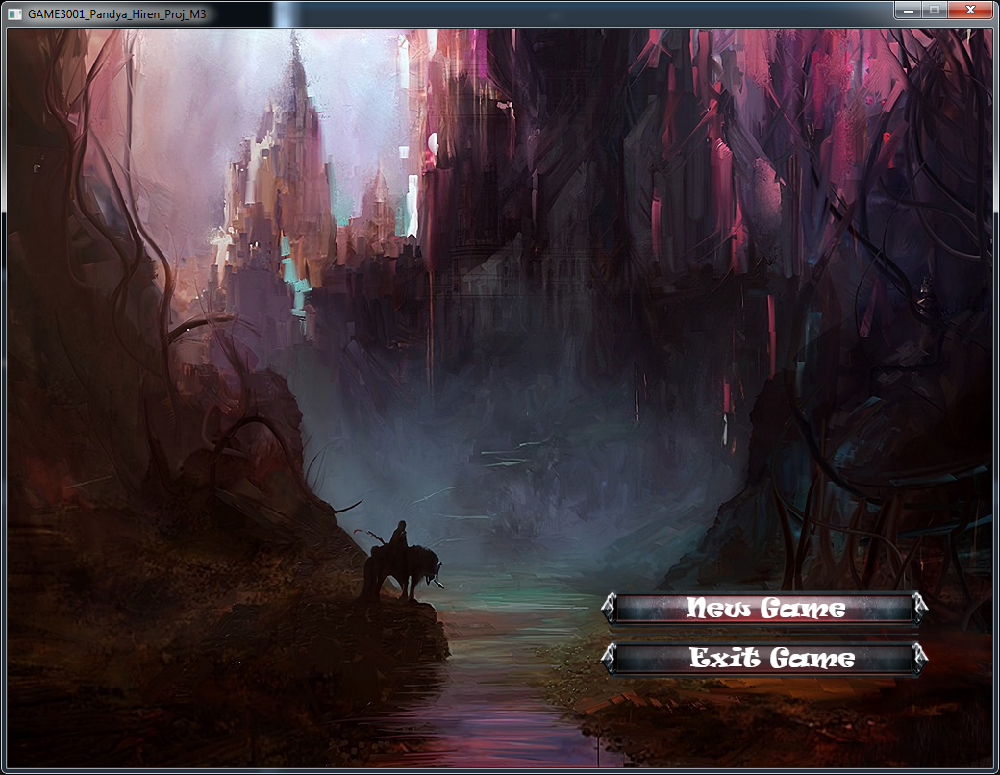
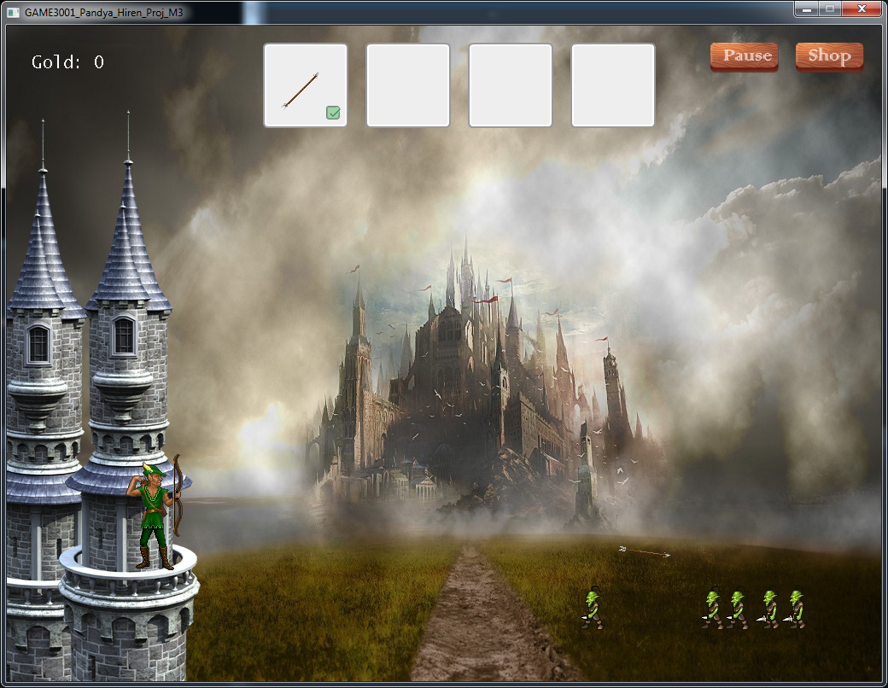
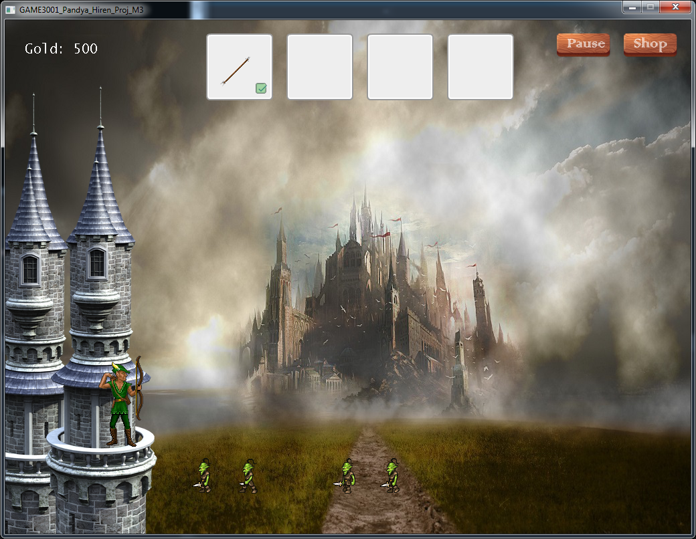
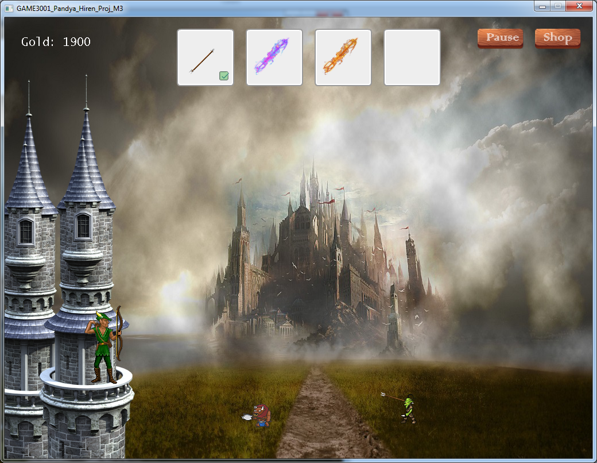
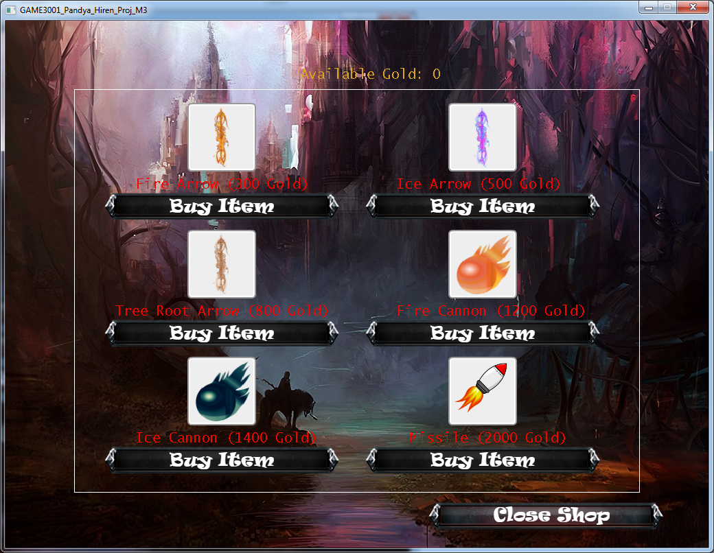
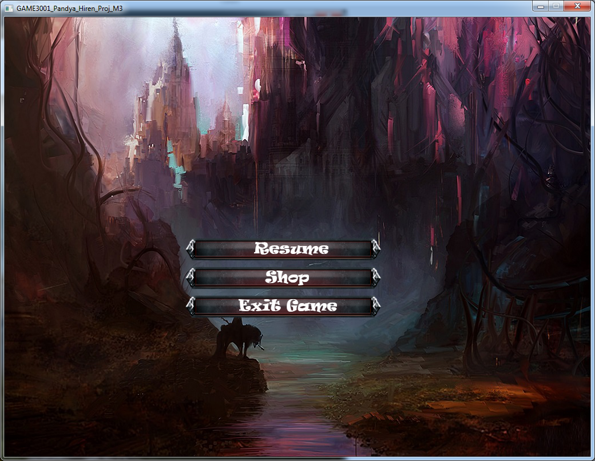

# CastleDefence-2D

### Castle Defence mini shooter game made using SDL. Defend your castle from oncoming waves of enemies. There are two different types of enemies. The game boasts a weapons inventory where player can buy different weapons using the gold earned by killing the enemies. The game was built as a part of milestone project in second semester.

# Libraries (Included in lib folder)
* Box2D
* SDL2 2.0.8
* SDL2_image 2.0.4
* SDL2_mixer 2.0.4
* SDL2_ttf 2.0.15

# Screenshots

### Title Screen

### Gameplay 1

### Gameplay 2

### Gameplay 3

### Gameplay 4

### Gameplay 5

### Gameplay - Gameshop

### Gameplay - Pause Screen

